#  BlahST - Speech Input in Any Editable Text Field </img>
**Blah** **S**peech-to-**T**ext lets you have a bla(h)st inputing text from speech on Linux, with keyboard shortcuts and whisper.cpp. Fire up your microphone and perform high-quality, multilingual speech recognition offline. Extended with local LLMs, it becomes a potent tool to converse with your Linux computer. No VRAM-consuming GUI, just a few configurable [hotkeys](./resources/hotkeys.png).

**BlahST is probably the leanest Whisper-based speech-to-text input tool for Linux, sitting on top of whisper.cpp.** 

- **Fast transcription with `wsi` via local whisper.cpp, or a whisper.cpp server for even faster [network transcription.](./API_TRANSCRIBE.md)**
- **Can select speech input language and translate to English with the dedicated `wsiml` script**
- **Option to use a [downloaded](https://huggingface.co/Mozilla/whisperfile/tree/main) portable [whisperfile](https://huggingface.co/Mozilla/whisperfile), (with a hotkey set for `wsi -w`)**
- **The `blooper` utility allows continuous "hands-free" speech input or dictation with automatic pasting loop, using xdotool or ydotool. Exits on longer silence and can be reactivated with a hotkey.**
- **Interaction with local LLMs via [llama.cpp](https://github.com/ggerganov/llama.cpp) or a [llamafile](https://github.com/Mozilla-Ocho/llamafile), producing textual answers or translations that are both spoken back and available in the clipboard. This functionality is in the `wsiAI` script.** 
- **EXPERIMENTAL: Added AI proofreader, triggered on any selected (editable) text by speech: "Computer, proofread ... or Computer be like Grammarly..". After a short while, the selected text should be automatically replaced by the LLM.**
- **NEW: Low-latency speech chat with local LLMs via the `blahstbot` tool. Natural, spoken conversation with Gemma3 (preset in blahstbot). Please, see next video for a demo on an average Linux computer with a 12GB GPU (unmute audio)
  ([Another demo with multilingual speech](./SPEECH-CHAT.md))**
    
https://github.com/user-attachments/assets/022adffc-3e13-48cd-be5d-5919f1d5cae7

_The above video demonstrates using `blahstbot` for spoken interaction with Gemma3_12B, loaded in llama-server on localhost. There is no delay, the LLM actually answers unnaturally quickly, making the conversation smooth. Under the hood, the script (triggered with a Gnome hotkey bound to `blahstbot -n`) passes the text from the recognized speech to llama-server, gets the response back, formats it and sends it to piper for TTS conversion, while also loading it in the clipboard. Note that the LLM fits completely in GPU VRAM, which helps the snappy performance._
    
Using low-resource, optimized command-line tools, spoken text input happens very fast. Here is a demonstration video (please, UNMUTE the audio) with some local LLM features (AI assistant, translator, scheduller, CLI guide in testing stage):

https://github.com/user-attachments/assets/877c699d-cf8b-4dd2-bc0e-75dee9054cf2

_In the above video, the audio starts with the system anouncing the screencasting (my GNOME extension ["Voluble"](https://github.com/QuantiusBenignus/voluble) speaks outloud all GNOME desktop notifications), followed by multiple turns of speech input/recognition. Demonstrated at the end is one of the upcomming "AI functions" which uses the text transcribed by BlahST (whisper.cpp), formats it into a LLM prompt and sends it to a local multilingual LLM (llama.cpp or llamafile) which returns the Chinese translation as text and also speaks it using a neural TTS. Orchestrating this from the command line with lean executables leaves the system surprisingly snappy (From the video you can see that the PC barely breaks any sweat - temperatures remain low-ish.)_


https://github.com/user-attachments/assets/c3842318-14cb-4874-8651-7bc92abd187f

_The above video (unmute please) demonstrates the use of blooper, modified from wsi to transcribe in a loop, until the user terminates speech input with a longer pause (~3sec as preset). With the use of xdotool (or ydotool for Wayland users), text is pasted automatically on any pause (or on hotkey interuption). For the video above, the speech is generated with a synthetic voice and collected by the microphone. This allows me to edit the text concurrently (multitaskers, don't try this at home:). At the end, the top-bar microphone icon should disappear, indicating program exit. It does not happen in the video because the screencast utility has a claim on the icon too._

### Principle of Operation (_the best UI is no UI at all._)
The idea with BlahST is to be the UI-free software equivalent of a tsunami; short and powerfull wave of CPU/GPU action and then it is completely gone, with only textual traces in the clipboard and relative desktop peace. Just use a pair of hotkeys to start and stop recording from the microphone and send the recorded speech to whisper.cpp [[server]](./API_TRANSCRIBE.md) which dumps transcribed text into the clipboard (unless you pass it by a local LLM before that). An universal approach that should work in most Linux desktop environments and distributions.

The work is done by one of the scripts:
- *wsi* for general speech input, 
- *wsiml* for multilingual users,
- *wsiAI* for users who want to also speak with a local large language model using llama.cpp or a llamafile.
- *blooper* is an experimental tool for continouous dictation that will exit if a longer pause is detected.
- *blahstbot* is a tool for spoken chat with a local (LAN) LLM, performing low-latency speech-to(-text-to)-speech spoken conversation and making the LLM responce available to (auto)paste.

```mermaid
flowchart LR
    style net fill:#1af,stroke:#333,stroke-width:2px
    E0==>ST 
    E1 ==> ST[🎤Speech-to-Text Input Anywhere]
    E1 ==> D[✨Experimental AI Tools]
    E2 ==>|flags -l -t|Ml[🌐 Multilingual Speech to Text.
Translation into English]
    E3 ==> D1[⌨️ Continuous Dictation\n Automatic Paste and Stop]
	   D -->|"Assistant..."| D6([🤖 One-shot AI Assistant])
     D -->|"Computer..."| D2([📝 AI Proofreader, via speech keyword])
	   D --> |"Translator..."|D4([🌍 AI Translator])
    E4 ==> D3[💬 Low-latency Speech Chat with a Local LLM 🤖]
    subgraph net [<h3><b>BlahST<br></b></h3>]
	   direction TB
	   E0{{wsi}}
     E1{{wsiAI}}
     E2{{wsiml}}
     E3{{blooper}}
     E4{{blahstbot}}
    end
```
  


Speech recognition is performed by whisper.cpp which must be precompiled on your Linux system or available as a [server](https://github.com/ggerganov/whisper.cpp/tree/master/examples/server) instance on your LAN or localhost.
Alternativelly, you can choose to simply download and use an actually portable executable (with an embedded whisper model) [whisperfile](https://huggingface.co/Mozilla/whisperfile/tree/main), now part of the [llamafile](https://github.com/Mozilla-Ocho/llamafile) repository. 

When speech input is initiated with a hotkey, a microphone indicator appears in the top bar (at least in GNOME) and is shown for the duration of the recording (can be interupted with another hotkey).
The disappearance of the microphone icon from the top bar indicates completion and the transcribed text can be pasted from the clipboard. On slower systems there may be a slight delay after the microphone icon disappears and before the text reaches the clipboard due to longer transcription time. On my computer, via the whisper.cpp server API, it is less than 150 ms (300 ms with local whisper.cpp) for an average paragraph of spoken text.

For keyboard-only operation, with the standard `CTRL+V` for example, the standard clipboard will be used under X11 and Wayland (`wsi` or `wsiml`), while `wsi -p` (or `wsiml -p`) uses the PRIMARY sellection and text is pasted with the middle mouse button). For left-hand paste, speech recording can be relegated to hotkeys triggered with the right hand. ** For example I have setup the unused "+" (START RECORDING) and "Insert" (STOP RECORDING) keys on the numeric keypad. 

<details>
<summary>DATAFLOW DIAGRAMS</summary>
   
   #### wsiAI script (w sample LLM interaction)
   

   #### blooper (speech input in a loop)

</details>

#### SUMMARY
* On the press of a hotkey combo, the `wsi -p` script will record speech (stopped with a hotkey or by silence detection), use a local copy of whisper.cpp and send the transcribed text to the PRIMARY selection under, either X11 or Wayland.
Then all one has to do is paste it with the middle mouse button anywhere they want. (For people holding the mouse with their right hand, speech recording hotkeys for the left hand would make sense.) 

* If using `wsi` with no flags (the approaches can coexist, just set up different set of hotkeys), the transcribed text is sent to the clipboard (not PRIMARY selection) under, either X11 or Wayland.
Then pasting happens with the `CTRL+V` (`CTRL+SHIFT+V` for GNOME terminal) or `SHIFT+INSert` keys as usual. (For most people, right-hand hotkeys would work well.)

* If transcribing over the network with `wsi -n` (selected with a hotkey of its own), the script will attempt to send the recorded audio to a running, properly set whisper.cpp server (on the LAN or `localhost`).
  It will then collect the textual response and format it for pasting with the `CTRL+V` (`CTRL+SHIFT+V` for GNOME terminal) or `SHIFT+INSert` keys (to paste with the middle mouse button use `wsi -n -p` instead).
* If using a whisperfile instead of, or in addition to a compiled whisper.cpp, invoke with `wsi -w ...` and the script will use the preset actually portable executable with the embedded whisper model of choice.  
* For multilingual users, in addition to the features of wsi, `wsiml` provides the ability to specify a language, e.g. `-l fr` and the option to translate to english with `-t`. The user can in principle assign multiple hotkeys to the various languages they transcribe or translate from. For example, two additional hotkeys can be set, one for transcribing and another for translating from French by assigning the commands `wsiml -l fr` and `wsiml -l fr -t` correspondingly.

* **blooper:** Users can use the supplied script **blooper** for continuous, automatic speech-to-text input (no need to press CTRL+V or click middle mouse button.) This is demonstrated in the second video above. Please, note that the Clipboard is used by default, the text will be autopasted under the keyboard carret, but in principle the PRIMARY selection can be set up instead, a middle mouse button click will be simulated and the text pasted at the current position of the mouse pointer at the (somewhat arbitrary) time the text is available. Please, note that this relies on silence detection, which depends on your physical environment. In noisy environments, use the hot key to stop recording.
* **blahstbot** When all one wants to do is have a spoken conversation with a local LLM, they can use **blahstbot** to perform UI-free speech chat with minimal latency. This can be done from a slower computer over LAN (since whisper server and llama-server are used, with a hotkey bound to `blahstbot -n`) and does not need to be a continuous conversation with contiguous text exchange. The user can perform other tasks between questions, use the supplied answers (available in the clipboard) and then come back later to continue within the context or change the subject. 
---

### SYSTEM SETUP

#### PREREQUISITES:
- zsh command-line shell installation on a Linux system running any modern desktop environment.   
- working [whisper.cpp installation](https://github.com/ggerganov/whisper.cpp) or a listening whisper.cpp server on your LAN/localhost (see network-transcription [section](./API_TRANSCRIBE.md)), or optionally a  [downloaded](https://huggingface.co/Mozilla/whisperfile/tree/main)  whisperfile.
- The orchestrator tools **wsi**, **wsiAI** or **wsiml** (along with **blooper** and **blahstbot**) from this repository **must be placed in your $HOME/.local/bin/ folder, in your $PATH** (The installation script `install-wsi` handles most of these).  
- recent versions of 'sox', 'xsel' (or 'wl-copy' on Wayland) command-line tools from your system's repositories.
-  A working microphone 
> *DISCLAIMER: The author neither takes credit nor assumes any responsibility for any outcome that may or may not result from interacting with the contents of this document. The proposed actions and automations (e.g. installation locations etc.) are merely suggestions and are based on the author's choice and opinion. As they may not fit the taste or the particular situation of everyone, please, adjust as needed.*

#### INSTALLATION
In a folder of your choice, clone the BlahST repository and then choose an installation method from below:

```
git clone https://github.com/QuantiusBenignus/BlahST.git
cd ./BlahST
```

<details>
<summary>USING THE INSTALLATION SCRIPT</summary>
Run the script `install-wsi` from the folder of the cloned repository and follow the prompts. It will move the scripts and make them executable, create a link to whisper.cpp `main` executable, set the environment, set a default whisper.cpp model, check for dependencies and request their installation if missing, etc. The script will also help you with the setup a whisperfile of your choice if you select that option.
The installation script also handles setup for network transcription, but the IP and port for the whisper.cpp server must be set manually in `wsi` and/or `wsiAI`, `wsiml`
Run the script `wsi` or `wsiAI` or`wsiml` directly from the command line first to verify its proper operation. Later it will be invoked only with [hotkeys](https://github.com/QuantiusBenignus/BlahST/#gui-setup-of-hotkeys) for speed and convenience.
</details>
<details>
<summary>MANUAL INSTALLATION</summary>

*(Assuming whisper.cpp is installed and the "main" executable compiled with 'make' in the cloned whisper.cpp repo. See Prerequisites section)*
* Place the scripts **wsi** and/or **wsiAI**, **wsiml**, **blooper** and **blahstbot** in $HOME/.local/bin/
* Make it executable
  ```
  cd $HOME/.local/bin; chmod +x wsi wsiAI wsiml blooper blahstbot
  ```
* Run once from the command line to let the scripts check for required dependencies
* If using local whisper.cpp, create a symbolic link (the code expects 'transcribe' in your $PATH) to the compiled "main" executable in the whisper.cpp directory.
  For example, create it in your `$HOME/.local/bin/` (part of your $PATH) with 
```
ln -s /full/path/to/whisper.cpp/main $HOME/.local/bin/transcribe
```
If transcribe is not in your $PATH, either edit the call to it in **wsi** to include the absolute path, or add its location to the $PATH variable. Otherwise the script will fail.
If you prefer not to compile whisper.cpp, or in addition to that, download and set the executable flag of a suitable whisperfile, for example:
```
cd $HOME/.local/bin
wget https://huggingface.co/Mozilla/whisperfile/resolve/main/whisper-tiny.en.llamafile
chmod +x whisper-tiny.en.llamafile
```
</details>
 
#### CONFIGURATION

**IMPORTANT:** The configuration will be migrated into a single file **blahst.cfg** that will be shared by all tools. Currently used by **blahstbot** only.
Inside the `wsi`, `wsiAI`, `wsiml` or `blooper` script, near the beginning, there is a clearly marked section, named **"USER CONFIGURATION BLOCK"**, where all the user-configurable variables have been collected. 
Most can be left as is but the important ones are the location of the (whisper, LLM, TTS) model files that you would like to use during transcription (or the IP and port number for the whisper.cpp server). 
If using a whisperfile, please, set the WHISPERFILE variable to the filename of the previously downloaded executable whisperfile, i.e. `WHISPERFILE=whisper-tiny.en.llamafile` (must be in the $PATH). 

##### GUI SETUP OF HOTKEYS
To start and stop speech input, for both manual and automatic installation
<details>
<summary> CASE 1: GNOME</summary>

##### Hotkey to start recording of speech
* Open your GNOME system settings and find "Keyboard".
* Under "Keyboard shortcuts", "View and customize shortcuts"
* In the new window, scroll down to "Custom Shortcuts" and press it.
* Press "+" to add a new shortcut and give it a name: "Start Recording Speech"
* In the "Command" field type `/home/yourusername/.local/bin/wsi -p` for using the middle mouse button or change it to `.../wsi` for using the clipboard.
* (For users of the multi-lingual models, replace `wsi` above with `wsiml` and if using a whisperfile, add the `-w` flag, i.e. `/home/yourusername/.local/bin/wsi -w` ). Finally, to sample the LLM functions, replace `wsi` with `wsiAI`.
* Then press "Set Shortcut" and select a (unused) key combination. For example a key combo like **CTRL+ALT+a** or a single unused key like **KP+** (keypad +).
* Click Add and you are done. 

The orchestrator script has a silence detection filter in the call to sox (rec) and would stop recording (in the best case) on 2 seconds of silence.
In addition, if one does not want wait or has issues with the silence detection threshold:

##### Manual speech recording interuption (strongly recommended)
For those who want to be able to interupt the recording manually with a key combination, in the spirit of great hacks, we are going to use the system built-in features:
* Open your GNOME system settings and again, find "Keyboard".
* Under "Keyboard shortcuts", "View and customize shortcuts"
* In the new window, scroll down to "Custom Shortcuts" and press it.
* Press "+" to add a new shortcut and give it a name: "Interupt Speech Input!"
* In the "Command" field type `pkill --signal 2 rec`
* Then press "Set Shortcut" and select a (unused) key combination. For example a key combo like **CTRL+ALT+x** or a single unused key like **KP-** (keypad -).
* Click Add and you are done.
  
That Simple.  Just make sure that the new key binding has not been set-up already for something else.
Now when the script is recording speech, it can be stopped with the new key combo and transcription will start immediatelly.
</details>

<details>
<summary> CASE 2: XFCE4</summary>
This is simalr to the GNOME setup above (for reference, see its more detailed instructions) 
  
* Open the Xfce4 Settings Manager.
* Navigate to Keyboard → Application Shortcuts.
* Click on the Add button to create a new shortcut.
* Enter the name of the shortcut and the command e.g. `/home/yourusername/.local/bin/wsi -p`  or `.../wsi` for using the clipboard.
* (For users of the multi-lingual models, replace `wsi` above with `wsiml` and if using a whisperfile, add the `-w` flag, i.e. `/home/yourusername/.local/bin/wsi -w` ). Finally, to sample the LLM functions, replace `wsi` with `wsiAI`.
* Press the keys you wish to assign to the shortcut.
* Click OK to save the shortcut.
 The hotkey to stop speech recording should be done similarly with another key combo and the command `pkill --signal 2 rec`.
</details>

<details>
<summary> 
CASE 3: KDE (Plasma)
</summary>
This is similar to the GNOME setup above (for reference, see its more detailed instructions)
  
* Open the System Settings application.
* Navigate to Shortcuts and then Custom Shortcuts.
* Click on Edit and then New to create a new group for your shortcuts if needed.
* Under the newly created group, click on New again and select Global Shortcut -> Command/URL.
* Give your new shortcut a name.
* Choose the desired shortcut key combination by clicking on the button next to "None" and pressing the keys you want to assign to the shortcut.
* In the Trigger tab, specify the command to be executed when the shortcut is triggered. e.g. `/home/yourusername/.local/bin/wsi` or `.../wsi -p`
* (For users of the multi-lingual models, replace `wsi` above with `wsiml` and if using a whisperfile, add the `-w` flag, i.e. `/home/yourusername/.local/bin/wsi -w` ). Finally, to sample the LLM functions, replace `wsi` with `wsiAI`.
* Ensure that the Enabled checkbox is checked to activate the shortcut.
* Apply the changes by clicking Apply or OK.
The hotkey to stop speech recording should be done similarly with another key combo and the command `pkill --signal 2 rec`. 
</details>

Please, note that there may be slight variations in the above steps depending on the version installed on your system.
For many other environements, such as **Mate, Cinnamon, LXQt, Deepin**, etc. the steps should be somewhat similar to the examples above.
Please, consult the documentation for your systems desktop environment.
#### TO DO
- [x] POSIX compliant installation script
- [ ] POSIX compliant orchestration scripts

---

<details>
  <summary>TIPS AND TRICKS</summary>

##### Sox silence detection

Sox is recording in wav format at 16k rate, the only currently accepted by whisper.cpp. This is done in **wsi** with this command:
`rec -t wav $ramf rate 16k silence 1 0.1 3% 1 2.0 6% `
Sox will attempt to stop on silence of 2s with signal level threshold of 6%. A very noisy environment will prevent the detection of silence and the recording (of noise) will continue. This is a problem and a remedy that may not work in all cases is to adjust the duration and silence threshold in the sox filter in the `wsi` script. Of course, one can use the manual interuption method if preferred.
We can't raise the threshold arbitrarily because, if one consistently lowers their voice (fadeout) at the end of speech, it may get cut off if the threshold is high. Lower it in that case to a few %.    
It is best to try to make the speech distinguishable from noise by amplitude (speak clearly, close to the microphone), while minimizing external noise (sheltered location of the microphone, noise canceling hardware etc.)
With good speech signal level, the threshold can then be more effective, since SNR (speech-to-noise ratio:-) is effectively increased. 
After the speech is captured, it will be passed to `transcribe` (whisper.cpp) for speech recognition. This will happen faster than real time (especially with a fast CPU or if your whisper.cpp installation uses CUDA). One can adjust the number of processing threads used by adding  `-t n` to the command line parameters of transcribe (please, see whisper.cpp documentation). 
The script will then parse the text to remove non-speech artifacts, format it and send it to the PRIMARY selection (clipboard) using either X11 or Wayland tools. 

##### Multilingual Support
In principle, whisper (whisper.cpp) **is multilingual** and with the correct model file, this application will output UTF-8 text transcribed in the correct language. The `wsiml` script is dedicated to multi-lingual use and with it the user is able to choose the language for speech input (using the `-l LC` flag where LC is the language code) and can also translate the speech in the chosen input language to English with the `-t` flag. The user can assign multiple hotkeys to the various languages that they want to transcribe or translate from. For example, two additional hotkeys can be set, one for transcribing and another for translating from French by assigning the commands `wsiml -l fr` and `wsiml -l fr -t` correspondingly.

Please, note that when using the server mode, now you have 2 choices. You can have either the precompiled whisper.cpp server or the downloaded whisperfile (in server mode) listen at the preconfigured host and port number. The orchestrator script approaches them the same way.

##### Protecting the speech input hotkey from multiple invocations
Sometimes, one can mistakenly press the hotkey dedicated to starting `wsi` ( or `wsiAI`, `blooper`, `blahstbot`) instead of the hotkey to stop recording, while the script is already running. This may create a resource utilization mess and is obviously not desired. A way to prevent it is to expand the command assigned to the hotkey from `blahstbot -n` (the chatbot command) to:

```
pidof -q blahstbot wsiAI || blahstbot -n
```
but this may not work unless it is wrapped in a new shell instance. That is why we implement this protection inside the corresponding script itself.
The chatbot utility is used as an example because this regime of operation (interactive speech-to-speech chat) is the most likely to suffer from user missuse the wrong hotkey, due to the increased frequency of use of these hotkeys during a chat.

##### Hotkey command to end speech input
The command proposed in the configuration for stoping speech recording is (2 equivalent forms)

```
pkill --signal 2 rec
pkill -SIGINT rec
```
but in some cases, under specific load conditions, this signal may not be reliably transmited to `rec` (`sox`).
Then try to use SIGTERM instead, which is a bit more aggressive but still will let `rec` clear its state gracefully:

```
pkill rec
pkill -SIGTERM rec
```

##### Stoping speech output of the chatbot
The LLM system prompt for the speech-to-speech `blahstbot` conversation mode instructs the LLM to not be too verbous. But when one finds it talking for too long, the speech can be stopped via the command:

```
pkill -SIGINT aplay
```
to which one can, of course, assign a hotkey for easy access.

##### Temporary directory and files
Speech-to-text transcription is memory- and CPU-intensive task and fast storage for read and write access can only help. That is why **wsi** stores temporary and resource files in memory, for speed and to reduce SSD/HDD "grinding": `TEMPD='/dev/shm'`. 
This mount point of type "tmpfs" is created in RAM (let's assume that you have enough, say, at least 8GB) and is made available by the kernel for user-space applications. When the computer is shut down it is automatically wiped out, which is fine since we do not need the intermediate files.
In fact, for some types of applications (looking at you Electron), it would be beneficial (IMHO) to have the systemwide /tmp mount point also kept in RAM. Moving /tmp to RAM may speed up application startup a bit. A welcome speedup for any Electron app. In its simplest form, this transition is easy, just run:

`echo "tmpfs /tmp tmpfs rw,nosuid,nodev" | sudo tee -a /etc/fstab`
and then restart your Linux computer.
For the aforementioned reasons, especially if HDD is the main storage media, one can also move the ASR model files needed by whisper.cpp in the same location (/dev/shm). These are large files, that can be transferred to this location at the start of a terminal session (or at system startup). This can be done using your `.profile` file by placing something like this in it: 
```
([ -f /dev/shm/ggml-base.en.bin ] || cp /path/to/your/local/whisper.cpp/models/ggml* /dev/shm/)

```

https://github.com/QuantiusBenignus/cliblurt/assets/120202899/e4cd3e39-6dd3-421b-9550-4c428a5a8f0a
</details>

---
#### Contributing

- Could be as simple as starting a new discussion with an idea to expand the use case scenarios for BlahST. ( For example [use BlahST to ask Gemini questions](https://github.com/QuantiusBenignus/BlahST/discussions/13))
- Or send a PR for a new feature that substantially enhances BlahST
  
#### Credits
* Open AI (for [Whisper](https://github.com/openai/whisper))
* Georgi Gerganov and community ( for Whisper's C/C++ port [whisper.cpp](https://github.com/ggerganov/whisper.cpp))
* Justine Tunney, CJ Pais and the llamafile community (for llamafile and whisperfile)
* The **sox** developers (for the venerable "Swiss Army knife of sound processing tools")
* The creators and maintainers of CLI utilities such as **xsel, wl-copy, curl, jq, xdotool and others** that make the Linux environment (CLI and GUI) such a powerful paradigm.
